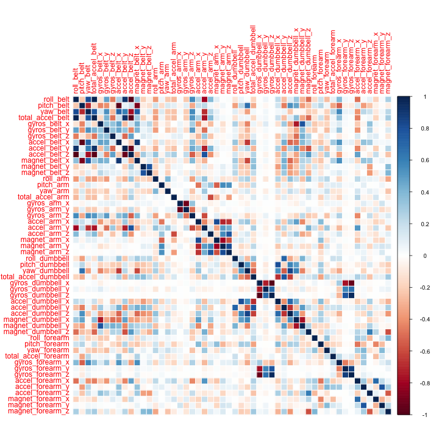
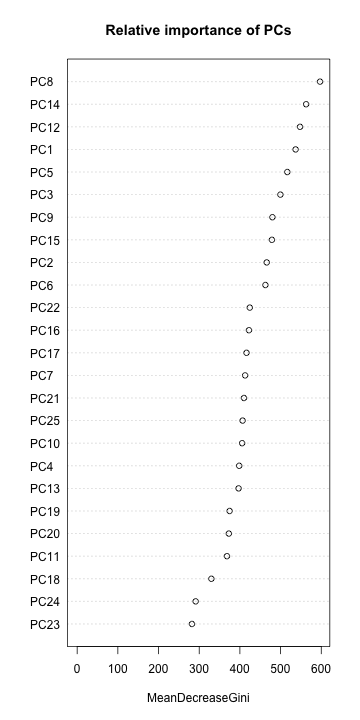

# Summary

Using devices such as Jawbone Up, Nike FuelBand, and Fitbit it is now possible to collect a large amount of data about personal activity relatively inexpensively. In this project, our goal will be to use data from accelerometers on the belt, forearm, arm, and dumbell of 6 participants. They were asked to perform barbell lifts correctly and incorrectly in 5 different ways.

We will fit a model to predict the manner in which the participants did the exercise. To achieve this we will use a random forest algorithm and a 5-fold cross validation. Our predicted results achieve 100% accuracy on the limited test dataset provided.

# Process Data processing

## Tidy data

First we need to download the train and test files.


```r
download.file("https://d396qusza40orc.cloudfront.net/predmachlearn/pml-training.csv", "~/pml-training.csv", method = "curl")
download.file("https://d396qusza40orc.cloudfront.net/predmachlearn/pml-testing.csv", "~/pml-testing.csv", method = "curl")
```

Then we read the csv file into two data frames named "pml.training" and "pml.testing".


```r
pml.training.raw <- read.csv("~/pml-training.csv")
pml.testing.raw <- read.csv("~/pml-testing.csv")
```

The training set consists of 160 variables in 19622 observations.
The testing set consists of 160 variables in 20 observations. 

The *classe* variable is the dependent variable as per the problem statement.


```r
names(pml.training.raw)
```

```
##   [1] "X"                        "user_name"               
##   [3] "raw_timestamp_part_1"     "raw_timestamp_part_2"    
##   [5] "cvtd_timestamp"           "new_window"              
##   [7] "num_window"               "roll_belt"               
##   [9] "pitch_belt"               "yaw_belt"                
##  [11] "total_accel_belt"         "kurtosis_roll_belt"      
##  [13] "kurtosis_picth_belt"      "kurtosis_yaw_belt"       
##  [15] "skewness_roll_belt"       "skewness_roll_belt.1"    
##  [17] "skewness_yaw_belt"        "max_roll_belt"           
##  [19] "max_picth_belt"           "max_yaw_belt"            
##  [21] "min_roll_belt"            "min_pitch_belt"          
##  [23] "min_yaw_belt"             "amplitude_roll_belt"     
##  [25] "amplitude_pitch_belt"     "amplitude_yaw_belt"      
##  [27] "var_total_accel_belt"     "avg_roll_belt"           
##  [29] "stddev_roll_belt"         "var_roll_belt"           
##  [31] "avg_pitch_belt"           "stddev_pitch_belt"       
##  [33] "var_pitch_belt"           "avg_yaw_belt"            
##  [35] "stddev_yaw_belt"          "var_yaw_belt"            
##  [37] "gyros_belt_x"             "gyros_belt_y"            
##  [39] "gyros_belt_z"             "accel_belt_x"            
##  [41] "accel_belt_y"             "accel_belt_z"            
##  [43] "magnet_belt_x"            "magnet_belt_y"           
##  [45] "magnet_belt_z"            "roll_arm"                
##  [47] "pitch_arm"                "yaw_arm"                 
##  [49] "total_accel_arm"          "var_accel_arm"           
##  [51] "avg_roll_arm"             "stddev_roll_arm"         
##  [53] "var_roll_arm"             "avg_pitch_arm"           
##  [55] "stddev_pitch_arm"         "var_pitch_arm"           
##  [57] "avg_yaw_arm"              "stddev_yaw_arm"          
##  [59] "var_yaw_arm"              "gyros_arm_x"             
##  [61] "gyros_arm_y"              "gyros_arm_z"             
##  [63] "accel_arm_x"              "accel_arm_y"             
##  [65] "accel_arm_z"              "magnet_arm_x"            
##  [67] "magnet_arm_y"             "magnet_arm_z"            
##  [69] "kurtosis_roll_arm"        "kurtosis_picth_arm"      
##  [71] "kurtosis_yaw_arm"         "skewness_roll_arm"       
##  [73] "skewness_pitch_arm"       "skewness_yaw_arm"        
##  [75] "max_roll_arm"             "max_picth_arm"           
##  [77] "max_yaw_arm"              "min_roll_arm"            
##  [79] "min_pitch_arm"            "min_yaw_arm"             
##  [81] "amplitude_roll_arm"       "amplitude_pitch_arm"     
##  [83] "amplitude_yaw_arm"        "roll_dumbbell"           
##  [85] "pitch_dumbbell"           "yaw_dumbbell"            
##  [87] "kurtosis_roll_dumbbell"   "kurtosis_picth_dumbbell" 
##  [89] "kurtosis_yaw_dumbbell"    "skewness_roll_dumbbell"  
##  [91] "skewness_pitch_dumbbell"  "skewness_yaw_dumbbell"   
##  [93] "max_roll_dumbbell"        "max_picth_dumbbell"      
##  [95] "max_yaw_dumbbell"         "min_roll_dumbbell"       
##  [97] "min_pitch_dumbbell"       "min_yaw_dumbbell"        
##  [99] "amplitude_roll_dumbbell"  "amplitude_pitch_dumbbell"
## [101] "amplitude_yaw_dumbbell"   "total_accel_dumbbell"    
## [103] "var_accel_dumbbell"       "avg_roll_dumbbell"       
## [105] "stddev_roll_dumbbell"     "var_roll_dumbbell"       
## [107] "avg_pitch_dumbbell"       "stddev_pitch_dumbbell"   
## [109] "var_pitch_dumbbell"       "avg_yaw_dumbbell"        
## [111] "stddev_yaw_dumbbell"      "var_yaw_dumbbell"        
## [113] "gyros_dumbbell_x"         "gyros_dumbbell_y"        
## [115] "gyros_dumbbell_z"         "accel_dumbbell_x"        
## [117] "accel_dumbbell_y"         "accel_dumbbell_z"        
## [119] "magnet_dumbbell_x"        "magnet_dumbbell_y"       
## [121] "magnet_dumbbell_z"        "roll_forearm"            
## [123] "pitch_forearm"            "yaw_forearm"             
## [125] "kurtosis_roll_forearm"    "kurtosis_picth_forearm"  
## [127] "kurtosis_yaw_forearm"     "skewness_roll_forearm"   
## [129] "skewness_pitch_forearm"   "skewness_yaw_forearm"    
## [131] "max_roll_forearm"         "max_picth_forearm"       
## [133] "max_yaw_forearm"          "min_roll_forearm"        
## [135] "min_pitch_forearm"        "min_yaw_forearm"         
## [137] "amplitude_roll_forearm"   "amplitude_pitch_forearm" 
## [139] "amplitude_yaw_forearm"    "total_accel_forearm"     
## [141] "var_accel_forearm"        "avg_roll_forearm"        
## [143] "stddev_roll_forearm"      "var_roll_forearm"        
## [145] "avg_pitch_forearm"        "stddev_pitch_forearm"    
## [147] "var_pitch_forearm"        "avg_yaw_forearm"         
## [149] "stddev_yaw_forearm"       "var_yaw_forearm"         
## [151] "gyros_forearm_x"          "gyros_forearm_y"         
## [153] "gyros_forearm_z"          "accel_forearm_x"         
## [155] "accel_forearm_y"          "accel_forearm_z"         
## [157] "magnet_forearm_x"         "magnet_forearm_y"        
## [159] "magnet_forearm_z"         "classe"
```

It is notable that many of the 159 predictors are missing most of the observations.


```r
sum(complete.cases(pml.training.raw))
```

```
## [1] 406
```

So, to tidy the datasets up we remove the columns containing NA values.


```r
pml.training.raw <- pml.training.raw[, colSums(is.na(pml.training.raw)) == 0]
pml.testing.raw <- pml.testing.raw[, colSums(is.na(pml.testing.raw)) == 0]
```

Also notable is that some of the variables do not come from accelerometer measurements, but only record experimental setup or participants' data. Consequently we will treat them as potential confounders and discard the following variables: 
*X*, *user_name*, *raw_timestamp_part1*, *raw_timestamp_part2*, *cvtd_timestamp8, *new_window* & *num_window*.


```r
pml.training.raw <- pml.training.raw[, !grepl("X|user_name|timestamp|window", colnames(pml.training.raw))]
pml.testing.raw <- pml.testing.raw[, !grepl("X|user_name|timestamp|window", colnames(pml.testing.raw))]
pml.training.tidy <- pml.training.raw[, !grepl("^max|^min|^ampl|^var|^avg|^stdd|^ske|^kurt", colnames(pml.training.raw))]
pml.testing.tidy <- pml.testing.raw[, !grepl("^max|^min|^ampl|^var|^avg|^stdd|^ske|^kurt", colnames(pml.testing.raw))]
```

## Slice the data

Let us slice the tidied training dataset into a pure training dataset (70% observations) and a validation dataset (30% observations) using the *caret* package. Also let us use the validation dataset to perform cross validation when developing our model. To ensure reproducibility we set a random seed beforehand.


```r
library(caret)
```

```
## Warning: package 'caret' was built under R version 3.1.1
```

```
## Loading required package: lattice
## Loading required package: ggplot2
```

```r
set.seed(16009)
inTrain <- createDataPartition(y = pml.training.tidy$classe, p = 0.7, list = FALSE)
pml.train <- pml.training.tidy[inTrain, ]
pml.valid <- pml.training.tidy[-inTrain, ]
pml.test <- pml.testing.tidy
```

# Exploratory Analysis

Preently our dataset consists of 53 variables wich is way better than our original dataset. To further reduce this number, we look at the correlations between the variables in our dataset.


```r
pml.correlation <- cor(pml.train[, -53])
library(corrplot)
corrplot(pml.correlation, method = "color")
```

 

As we can see most predictors do not exhibit a high degree of correlation, however some variables are highly correlated.


```r
correlation.mat <- abs(pml.correlation)
diag(correlation.mat) <- 0
high.correlation <- which(correlation.mat > 0.8, arr.ind = TRUE)
for (i in 1:nrow(high.correlation)) {
    print(names(pml.train)[high.correlation[i, ]])
}
```

```
## [1] "yaw_belt"  "roll_belt"
## [1] "total_accel_belt" "roll_belt"       
## [1] "accel_belt_y" "roll_belt"   
## [1] "accel_belt_z" "roll_belt"   
## [1] "accel_belt_x" "pitch_belt"  
## [1] "magnet_belt_x" "pitch_belt"   
## [1] "roll_belt" "yaw_belt" 
## [1] "roll_belt"        "total_accel_belt"
## [1] "accel_belt_y"     "total_accel_belt"
## [1] "accel_belt_z"     "total_accel_belt"
## [1] "pitch_belt"   "accel_belt_x"
## [1] "magnet_belt_x" "accel_belt_x" 
## [1] "roll_belt"    "accel_belt_y"
## [1] "total_accel_belt" "accel_belt_y"    
## [1] "accel_belt_z" "accel_belt_y"
## [1] "roll_belt"    "accel_belt_z"
## [1] "total_accel_belt" "accel_belt_z"    
## [1] "accel_belt_y" "accel_belt_z"
## [1] "pitch_belt"    "magnet_belt_x"
## [1] "accel_belt_x"  "magnet_belt_x"
## [1] "gyros_arm_y" "gyros_arm_x"
## [1] "gyros_arm_x" "gyros_arm_y"
## [1] "magnet_arm_x" "accel_arm_x" 
## [1] "accel_arm_x"  "magnet_arm_x"
## [1] "magnet_arm_z" "magnet_arm_y"
## [1] "magnet_arm_y" "magnet_arm_z"
## [1] "accel_dumbbell_x" "pitch_dumbbell"  
## [1] "accel_dumbbell_z" "yaw_dumbbell"    
## [1] "gyros_dumbbell_z" "gyros_dumbbell_x"
## [1] "gyros_forearm_z"  "gyros_dumbbell_x"
## [1] "gyros_dumbbell_x" "gyros_dumbbell_z"
## [1] "gyros_forearm_z"  "gyros_dumbbell_z"
## [1] "pitch_dumbbell"   "accel_dumbbell_x"
## [1] "yaw_dumbbell"     "accel_dumbbell_z"
## [1] "gyros_forearm_z" "gyros_forearm_y"
## [1] "gyros_dumbbell_x" "gyros_forearm_z" 
## [1] "gyros_dumbbell_z" "gyros_forearm_z" 
## [1] "gyros_forearm_y" "gyros_forearm_z"
```

To cope with these highly correlated predictors we will use Principal Component Analysis (PCA) to pick the combination of predictors that captures the most information possible.

# Preprocessing

As mentioned before we use PCA on the training, validation and testing datasets to further reduce the number of predictors and the noise.


```r
preProc.pca <- preProcess(pml.train[, -53], method  = "pca", thresh = 0.95)
pml.train.pca <- predict(preProc.pca, pml.train[, -53])
pml.valid.pca <- predict(preProc.pca, pml.valid[, -53])
pml.test.pca <- predict(preProc.pca, pml.test[, -53])
print(preProc.pca)
```

```
## 
## Call:
## preProcess.default(x = pml.train[, -53], method = "pca", thresh = 0.95)
## 
## Created from 13737 samples and 52 variables
## Pre-processing: principal component signal extraction, scaled, centered 
## 
## PCA needed 25 components to capture 95 percent of the variance
```

# Data Modeling

## Fit the Model

Let us use the *Random Forest Algorithm (rf)* for activity recognition of weight lifting exercises since this details naturally with non-linear data. It additonally picks important variables & is robust to correlated covariates. This may result in a relatively low out-of-sample error (<5%). Let us choose a 5-fold cross validation method when applying the random forest algorithm.


```r
modFit <- train(pml.train$classe ~ ., method = "rf", data = pml.train.pca, trControl = trainControl(method = "cv", 5))
```

```
## Loading required package: randomForest
```

```
## Warning: package 'randomForest' was built under R version 3.1.1
```

```
## randomForest 4.6-10
## Type rfNews() to see new features/changes/bug fixes.
```

```r
modFit
```

```
## Random Forest 
## 
## 13737 samples
##    24 predictor
##     5 classes: 'A', 'B', 'C', 'D', 'E' 
## 
## No pre-processing
## Resampling: Cross-Validated (5 fold) 
## 
## Summary of sample sizes: 10990, 10991, 10989, 10989, 10989 
## 
## Resampling results across tuning parameters:
## 
##   mtry  Accuracy  Kappa  Accuracy SD  Kappa SD
##    2    1.0       1.0    0.003        0.004   
##   13    1.0       1.0    0.002        0.002   
##   25    0.9       0.9    0.005        0.007   
## 
## Accuracy was used to select the optimal model using  the largest value.
## The final value used for the model was mtry = 2.
```

Review relative importance of the resulting principal components of the trained model `modFit`.


```r
varImpPlot(modFit$finalModel, sort = TRUE, main = "Relative importance of PCs")
```

 

## Model performance on validation dataset

Now we are able to estimate the performance of the model on the validation dataset.


```r
pml.pred.valid <- predict(modFit, pml.valid.pca)
confusionMatrix(pml.valid$classe, pml.pred.valid)
```

```
## Confusion Matrix and Statistics
## 
##           Reference
## Prediction    A    B    C    D    E
##          A 1667    4    1    1    1
##          B   15 1105   17    1    1
##          C    1    9 1002   12    2
##          D    1    0   48  913    2
##          E    0    5    4    6 1067
## 
## Overall Statistics
##                                         
##                Accuracy : 0.978         
##                  95% CI : (0.974, 0.981)
##     No Information Rate : 0.286         
##     P-Value [Acc > NIR] : < 2e-16       
##                                         
##                   Kappa : 0.972         
##  Mcnemar's Test P-Value : 4.17e-05      
## 
## Statistics by Class:
## 
##                      Class: A Class: B Class: C Class: D Class: E
## Sensitivity             0.990    0.984    0.935    0.979    0.994
## Specificity             0.998    0.993    0.995    0.990    0.997
## Pos Pred Value          0.996    0.970    0.977    0.947    0.986
## Neg Pred Value          0.996    0.996    0.986    0.996    0.999
## Prevalence              0.286    0.191    0.182    0.159    0.182
## Detection Rate          0.283    0.188    0.170    0.155    0.181
## Detection Prevalence    0.284    0.194    0.174    0.164    0.184
## Balanced Accuracy       0.994    0.988    0.965    0.984    0.996
```

The out-of-sample error is the complementary to one of the model's accuracy.


```r
sample_err <- 1 - as.numeric(confusionMatrix(pml.valid$classe, pml.pred.valid)$overall[1])
sample_err
```

```
## [1] 0.02226
```

Conclusion is that estimated Out-of-Sample error based on our model applied to the validation dataset is 2.226% which is pretty good.

## Predict the results

Run the model against the test dataset, display the predicted results:


```r
pml.pred.test <- predict(modFit, pml.test.pca)
pml.pred.test
```

```
##  [1] B A C A A E D B A A B C B A E E A B B B
## Levels: A B C D E
```

## Performance of the prediction model on the data set

This prediction model achieves a `100%` accuracy on the limited test set provided.
